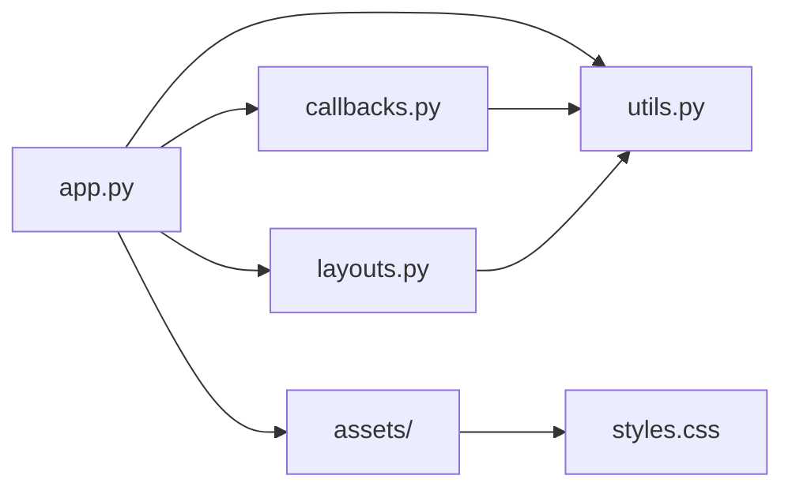

# Trade Simulation Dashboard

Trade Simulation Dashboard is a web application that allows users to analyze and visualize trade data from CSV files. It provides insights into the performance of trading strategies and helps users make informed decisions.

## Features

- Upload CSV files containing trade data
- Select relevant columns for analysis (datetime, price, position flag, settlement flag, quantity)
    - datetime column: Select the timestamp column for the asset being analyzed
    - price column: Select the price column for the asset being analyzed
    - position flag: Select the column indicating long or short positions, where 1 represents long, -1 represents short, and 0 represents no action
    - settlement flag: Select the column indicating position settlement, where 1 represents settlement and 0 represents no action. If this column does not exist in your data, you can select "None".
    - quantity column: Select the column representing the quantity, which should contain 0 or positive values. If this column does not exist in your data, you can select "None".
    
    The application can still function even if the settlement flag and quantity columns are not present in your data. In such cases, please select "None" for those columns.
    
- Validate and preprocess the selected data
- Generate interactive visualizations and metrics based on the selected data
- Compare the performance of the trading strategy against a buy-and-hold strategy
- Display key metrics such as cumulative returns, drawdowns, Sharpe ratio, and more


## Getting Started

### Prerequisites

- Python 3.x
- pip package manager

### Installation

1. Clone the repository:

```bash
git clone https://github.com/your-username/trade-simulation-dashboard.git
```

2. Navigate to the project directory:

```bash
cd trade-simulation-dashboard
```

3. Install the required dependencies:

```bash
pip install -r requirements.txt
```

### Usage

1. Run the application:

```bash
python app.py
```

2. Open a web browser and go to `http://localhost:8050`.

3. Upload the `test.csv` file located in the same directory to perform testing.

4. Select the relevant columns for analysis as described in the "Features" section.

5. Click the "Analyze" button to generate visualizations and metrics.

6. Explore the generated graphs and metrics to gain insights into the trading strategy's performance.


## Metrics

The Trade Simulation Dashboard provides various metrics to evaluate the performance of the trading strategy. Here are the key metrics calculated based on the code:

1. Cumulative Return:
   - The cumulative return is calculated as the sum of the 'Profit' column, which represents the profit or loss for each trade.
   - Formula: `df['Cumulative Profit'] = df['Profit'].fillna(0).cumsum()`

2. Cumulative Return Ratio:
   - The cumulative return ratio is calculated by dividing the cumulative profit by the initial price of the asset.
   - Formula: `df['Cumulative Profit Ratio'] = df['Cumulative Profit'] / df[price_col].iloc[0]`

3. Sharpe Ratio:
   - The Sharpe ratio is a risk-adjusted return metric that measures the excess return per unit of risk.
   - It is calculated by subtracting the risk-free rate from the average return and dividing the result by the standard deviation of returns.
   - Formula: `sharpe_ratio = (returns.mean() - risk_free_rate) / returns.std()`

4. Maximum Drawdown:
   - The maximum drawdown represents the largest percentage decline from a peak to a trough in the cumulative return.
   - It is calculated by finding the maximum peak in the cumulative return and then identifying the subsequent lowest trough.
   - Formula:
     ```python
     df['Max'] = df['Cumulative Profit Ratio'].cummax()
     df['Drawdown'] = df['Cumulative Profit Ratio'] - df['Max']
     max_drawdown_ratio = df['Drawdown'].min()
     ```

5. Win Rate:
   - The win rate represents the percentage of profitable trades out of the total number of trades.
   - It is calculated by dividing the number of trades with positive profit by the total number of trades.
   - Formula: `win_rate = winning_trades / total_trades`

6. Average Profit and Average Loss:
   - The average profit is calculated by taking the mean of the positive values in the 'Profit' column.
   - The average loss is calculated by taking the mean of the negative values in the 'Profit' column.
   - Formulas:
     - `avg_profit = df[df['Profit'] > 0]['Profit'].mean()`
     - `avg_loss = df[df['Profit'] < 0]['Profit'].mean()`

7. Profit Factor:
   - The profit factor is the ratio of the absolute value of the average profit to the absolute value of the average loss.
   - It indicates the profitability of the trading strategy.
   - Formula: `profit_factor = -avg_profit / avg_loss`

8. Position Period Ratio:
   - The position period ratio represents the proportion of time the trading strategy holds a position (long or short) compared to the total trading period.
   - It is calculated by dividing the number of rows where the position flag is not zero by the total number of rows.
   - Formula: `position_period_ratio = len(df[df[position_flag_col] != 0]) / len(df)`

These metrics provide valuable insights into the performance and characteristics of the trading strategy. By analyzing these metrics, users can assess the profitability, risk, and effectiveness of their trading approach.

Note: The code assumes that the 'Profit' column is calculated based on the position flag, settlement flag, and quantity columns, considering the specific rules and conditions of the trading strategy.
## File Structure

- `app.py`: The main application file that defines the layout and configuration.
- `callbacks.py`: Contains the callback functions for handling user interactions and updating the visualizations.
- `layouts.py`: Defines the layout components of the application.
- `utils.py`: Contains utility functions for data processing and analysis.
- `requirements.txt`: Lists the required Python packages for running the application.
- `assets/`: Directory for storing static assets such as CSS files.

## Contributing

Contributions are welcome! If you find any issues or have suggestions for improvements, please open an issue or submit a pull request.

## License

This project is licensed under the MIT License. See the [LICENSE](LICENSE) file for details.

## Acknowledgements

- [Dash](https://dash.plotly.com/) - The web framework used for building the application.
- [Plotly](https://plotly.com/) - The graphing library used for creating interactive visualizations.
- [Pandas](https://pandas.pydata.org/) - The data manipulation library used for processing and analyzing trade data.

---



In this diagram:
- `app.py` is the main application file that imports and uses the other modules.
- `callbacks.py` contains the callback functions and interacts with `utils.py` for data processing.
- `layouts.py` defines the layout components and interacts with `utils.py` for data processing.
- `utils.py` contains utility functions used by both `callbacks.py` and `layouts.py`.
- `assets/` is a directory that stores static assets, such as `styles.css`.


