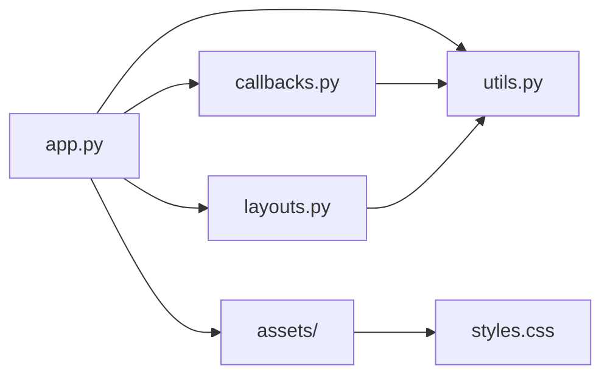
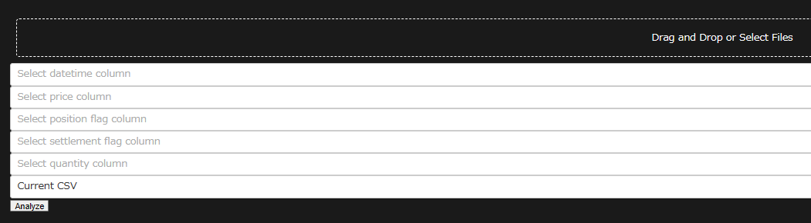

# Trade Simulation Dashboard

Trade Simulation Dashboard is a web application that allows users to analyze and visualize trade data from CSV files. It provides insights into the performance of trading strategies and helps users make informed decisions.

## Features

- Upload CSV files containing trade data
- Select relevant columns for analysis (datetime, price, position flag, settlement flag, quantity)
- Validate and preprocess the selected data
- Generate interactive visualizations and metrics based on the selected data
- Compare the performance of the trading strategy against a buy-and-hold strategy
- Display key metrics such as cumulative returns, drawdowns, Sharpe ratio, and more

## Getting Started

### Prerequisites

- Python 3.x
- pip package manager

### Installation

1. Clone the repository:

```bash
git clone https://github.com/your-username/trade-simulation-dashboard.git
```

2. Navigate to the project directory:

```bash
cd trade-simulation-dashboard
```

3. Install the required dependencies:

```bash
pip install -r requirements.txt
```

### Usage

1. Run the application:

```bash
python app.py
```

2. Open a web browser and go to `http://localhost:8050`.

3. Upload a CSV file containing trade data.

4. Select the relevant columns for analysis.

5. Click the "Analyze" button to generate visualizations and metrics.

6. Explore the generated graphs and metrics to gain insights into the trading strategy's performance.

## File Structure

- `app.py`: The main application file that defines the layout and configuration.
- `callbacks.py`: Contains the callback functions for handling user interactions and updating the visualizations.
- `layouts.py`: Defines the layout components of the application.
- `utils.py`: Contains utility functions for data processing and analysis.
- `requirements.txt`: Lists the required Python packages for running the application.
- `assets/`: Directory for storing static assets such as CSS files.

## Contributing

Contributions are welcome! If you find any issues or have suggestions for improvements, please open an issue or submit a pull request.

## License

This project is licensed under the MIT License. See the [LICENSE](LICENSE) file for details.

## Acknowledgements

- [Dash](https://dash.plotly.com/) - The web framework used for building the application.
- [Plotly](https://plotly.com/) - The graphing library used for creating interactive visualizations.
- [Pandas](https://pandas.pydata.org/) - The data manipulation library used for processing and analyzing trade data.

---



In this diagram:
- `app.py` is the main application file that imports and uses the other modules.
- `callbacks.py` contains the callback functions and interacts with `utils.py` for data processing.
- `layouts.py` defines the layout components and interacts with `utils.py` for data processing.
- `utils.py` contains utility functions used by both `callbacks.py` and `layouts.py`.
- `assets/` is a directory that stores static assets, such as `styles.css`.


