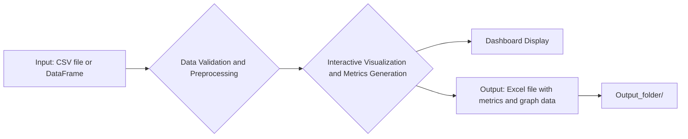
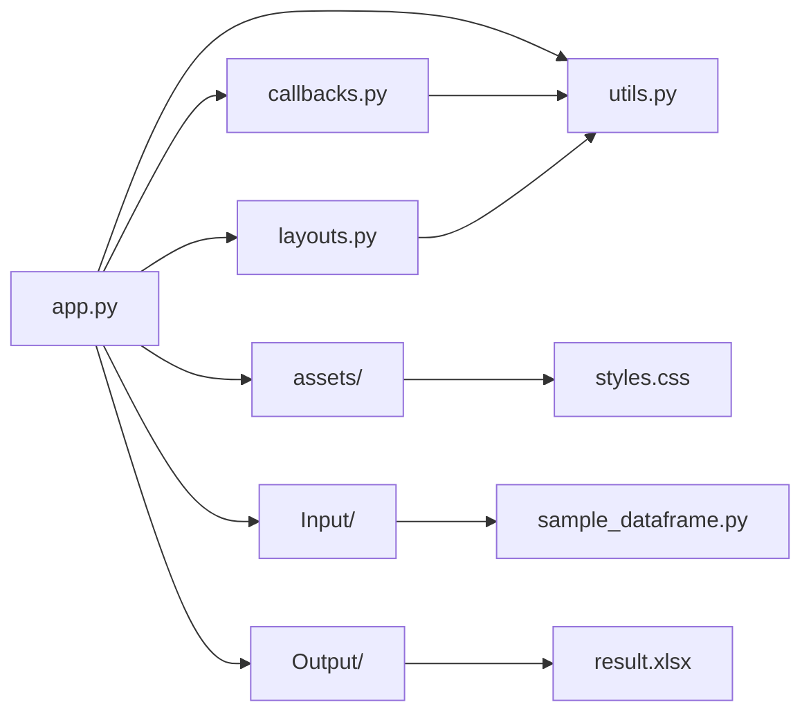

[](https://www.python.org/)
[](https://www.docker.com/)


# Trade Simulation Dashboard
**This document and the application were largely created using Claude3.**
 
Trade Simulation Dashboard is a web application that analyzes and visualizes trading data from CSV files (including Excel and pickle) or input pandas DataFrames to evaluate the performance of trading strategies.

The target users are system traders and cryptocurrency traders (botters). It also supports CSV and Excel file input, making it useful for those who manage their trading history in Excel or want to analyze their bot's trading history.

This application focuses on providing an interactive and convenient display of the simulation part, which is common in the analysis of trading strategies, where performance metrics such as Sharpe ratio, return, and drawdown are calculated based on the asset's price, the timing and quantity of position holding and closing. Compared to other libraries like Backtrader, Zipline, and Pyfolio, this application offers more concise and intuitive visualization by narrowing down the features. Unlike charting tools like TradingView, it not only supports the verification of trading strategies based on technical analysis using indicators but also allows easy backtesting of more complex and advanced trading strategy models using the data at hand. Furthermore, by outputting these metrics to an Excel file, more detailed analysis can be performed.

The main features of this application, summarized from the above, are as follows:
- Supports multiple input formats (CSV, Excel, pickle, pandas DataFrame)
- Interactive graph visualization and metrics display
- Provides a minimal dashboard necessary for evaluating trading strategies
- Compares the performance of trading strategies with a buy-and-hold strategy (future plans include comparison with other saved strategies)
- Stores each metric and graph data table in an Excel file in separate sheets

#### Please note that the concept of transaction fees is not yet implemented in the current version but will be added in the future (pull requests are welcome).

## Features

- Upload files or DataFrames containing the necessary columns for analysis
- Select columns (datetime, price, position flag, settlement flag, quantity)
    - datetime: Select the timestamp column for the asset being analyzed
    - price: Select the price column for the asset being analyzed
    - position flag: Select the column indicating long or short positions. 1 represents long, -1 represents short, and 0 represents no action
    - settlement flag: Select the column indicating position settlement. 1 represents settlement, and 0 represents no action. If there is no corresponding column, select "None"
    - quantity: Select the column representing the quantity. It must contain 0 or positive values. If there is no corresponding column, select "None"
    
    The application will still function if the settlement flag and quantity columns do not exist in the data. In that case, select "None" for those columns.
 
- Validation and preprocessing of the selected data
- Generation of interactive visualizations and metrics based on the selected data
- Comparison of the performance of the trading strategy with a buy-and-hold strategy
- Display of key metrics such as cumulative return, drawdown, and Sharpe ratio
- Storage of each metric and graph data table in an Excel file in separate sheets under the Output directory
- Visualization of graphs directly from a DataFrame by storing it in the get_dataframe function of a Python file under the Input directory (the sample is commented out by default)

## Getting Started

### Prerequisites

- Python 3.x
- pip package manager

### Installation (without Docker)

1. Clone the repository:

```bash
git clone https://github.com/ammtjm/Trade_Simulation_DashBoard.git
```

2. Navigate to the project directory:

```bash
cd Trade_Simulation_DashBoard/application
```

3. Install the required dependencies:

```bash
pip install -r requirements.txt
```

### Installation (with Docker)

1. Clone the repository:

```bash
git clone https://github.com/ammtjm/Trade_Simulation_DashBoard.git
```

2. Navigate to the project directory:

```bash
cd Trade_Simulation_DashBoard
```

3. Build the Docker image:

```bash
docker build -t trade-sim-dashboard .
```

4. Run the Docker container:

```bash
docker run -p 8050:8050 trade-sim-dashboard
```

### Usage

1. Run the application:

```bash
python app.py
```

2. Open a web browser and navigate to `http://localhost:8050`.

3. To perform a test, upload the `test.csv` file located in the same directory. Alternatively, create a get_dataframe function in a Python file under the Input directory and have it return a DataFrame.

4. Select the columns relevant to the analysis as described in the "Features" section.

5. Click the "Analyze" button to generate the visualizations and metrics.
 

6. An Excel file will be generated under the Output directory, containing each metric and graph data table in separate sheets.



## Metrics

Trade Simulation Dashboard provides various metrics to evaluate the performance of trading strategies. The following are the main metrics calculated based on the code:

1. Cumulative Return:
   - Cumulative return is calculated as the sum of the 'Profit' column, which represents the profit or loss of each trade.
   - Formula: `df['Cumulative Profit'] = df['Profit'].fillna(0).cumsum()`

2. Cumulative Return Ratio:
   - Cumulative return ratio is calculated by dividing the cumulative profit by the initial price of the asset.
   - Formula: `df['Cumulative Profit Ratio'] = df['Cumulative Profit'] / df[price_col].iloc[0]`

3. Sharpe Ratio:
   - Sharpe ratio is a metric that measures risk-adjusted return, representing the excess return per unit of risk.
   - It is calculated by subtracting the risk-free rate from the average return and dividing the result by the standard deviation of returns.
   - Formula: `sharpe_ratio = (returns.mean() - risk_free_rate) / returns.std()`

4. Maximum Drawdown:
   - Maximum drawdown represents the maximum percentage decrease from a peak to a trough in the cumulative return.
   - It is calculated by finding the maximum peak in the cumulative return and identifying the subsequent lowest trough.
   - Formula:
     ```python
     df['Max'] = df['Cumulative Profit Ratio'].cummax()
     df['Drawdown'] = df['Cumulative Profit Ratio'] - df['Max']
     max_drawdown_ratio = df['Drawdown'].min()
     ```

5. Win Rate:
   - Win rate represents the proportion of profitable trades out of the total number of trades.
   - It is calculated by dividing the number of trades with positive profit by the total number of trades.
   - Formula: `win_rate = winning_trades / total_trades`

6. Average Profit and Average Loss:
   - Average profit is calculated by taking the average of the positive values in the 'Profit' column.
   - Average loss is calculated by taking the average of the negative values in the 'Profit' column.
   - Formulas:
     - `avg_profit = df[df['Profit'] > 0]['Profit'].mean()`
     - `avg_loss = df[df['Profit'] < 0]['Profit'].mean()`

7. Profit Factor:
   - Profit factor is the ratio of the absolute value of average profit to the absolute value of average loss.
   - It indicates the profitability of the trading strategy.
   - Formula: `profit_factor = -avg_profit / avg_loss`

8. Position Period Ratio:
   - Position period ratio represents the proportion of time the trading strategy holds a position (long or short).
   - It is calculated by dividing the number of rows where the position flag is not 0 by the total number of rows.
   - Formula: `position_period_ratio = len(df[df[position_flag_col] != 0]) / len(df)`

These metrics provide valuable insights into the performance and characteristics of trading strategies. By analyzing these metrics, users can evaluate the profitability, risk, and effectiveness of their trading approaches.

Note: The code assumes that the 'Profit' column is calculated based on the position flag, settlement flag, and quantity columns, considering specific rules and conditions of the trading strategy.

## File Structure

- `app.py`: The main application file that defines the layout and configuration.
- `callbacks.py`: Contains callback functions that handle user interactions and update the visualizations.
- `layouts.py`: Defines the layout components of the application.
- `utils.py`: Contains utility functions for data processing and analysis.
- `requirements.txt`: Lists the required Python packages for running the application.
- `assets/`: Directory for storing static assets such as CSS files.
- `Input/`: Directory for storing Python files containing the get_dataframe function that returns a DataFrame.
- `Output_folder/`: Directory where the Excel file containing each metric and graph data table is generated.

## Contributing

Contributions are welcome! If you find any issues or have suggestions for improvements, please open an issue or submit a pull request.

## License

This project is licensed under the MIT License. See the [LICENSE](LICENSE) file for details.

## Acknowledgments

- [Dash](https://dash.plotly.com/) - The web framework used for building the application.
- [Plotly](https://plotly.com/) - The graphing library used for creating interactive visualizations.
- [Pandas](https://pandas.pydata.org/) - The data manipulation library used for processing and analyzing trade data.

---



This diagram illustrates:
- `app.py` is the main application file that imports and uses other modules.
- `callbacks.py` contains callback functions and interacts with `utils.py` for data processing.
- `layouts.py` defines the layout components and interacts with `utils.py` for data processing.
- `utils.py` contains utility functions used by both `callbacks.py` and `layouts.py`.
- `assets/` is a directory for storing static assets such as `styles.css`.
- `Input/` is a directory for storing Python files like `sample_dataframe.py` that contain the get_dataframe function returning a DataFrame.
- `Output/` is a directory where the Excel file like `result.xlsx` containing each metric and graph data table is generated.

## Author
X Account: [めるしー](https://twitter.com/fx24959482)