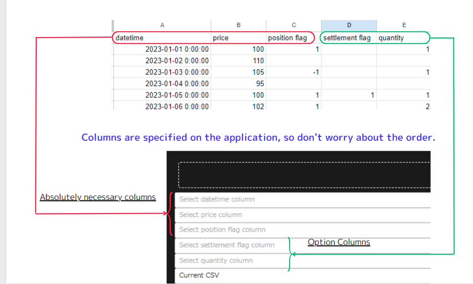

[](https://www.python.org/)
[](https://www.docker.com/)


# Trade Simulation Dashboard
＊＊本文並びに、本アプリはClaude3を利用して作成しております。＊＊
 
Trade Simulation Dashboard は、CSV(Excel,pickle含む)ファイルまたは入力pandasのデータフレームから取引データを分析・可視化し、トレード戦略のパフォーマンスを評価するためのWebアプリケーションです。

対象ユーザーはシステムトレーダーや暗号資産トレーダー（botter）を想定しています。CSVやエクセルファイル入力にも対応しているため、売買履歴をエクセルで管理している方や、botの取引履歴を分析したい方にも利用いただけます。

本アプリは、トレード戦略の分析において、対象資産の価格、ポジションの保有・解消のタイミングとその時の数量を元に、シャープレシオ、リターン、ドローダウンなどの評価指標を計算し、これをインタラクティブかつ簡便に表示することを目的としています。他のライブラリとして、Backtrader、Zipline、Pyfolioなどがありますが、本アプリはこれらと比較して機能を絞り込むことで、よりシンプルで直感的な可視化を提供できていると考えています。また、TradingViewのようなチャートツールとは異なり、インジケータ等を用いたテクニカル分析に基づくトレード戦略の検証だけでなく、手元のデータを用いたより複雑で高度なトレード戦略モデルのバックテストを簡単に行うことも可能です。さらに、これらの指標をエクセルファイルに出力することで、より詳細な分析を行うこともできます。

上記をまとめた本アプリケーションの特徴は、以下の通りです。
- 複数の入力形式に対応（CSV、Excel、pickle、pandasデータフレーム）
- インタラクティブなグラフの可視化とメトリクスの表示
- トレード戦略の評価に必要な最低限のダッシュボ一ドであること
- トレード戦略のパフォーマンスと買い持ち戦略の比較(今後は保存した他の戦略との比較も追加予定です)
- 出力されたエクセルファイルに各メトリクスとグラフの数値テーブルを格納する機能

#### 今バージョンでは取引手数料の概念も未実装ですが、今後追加する予定です（プルリクエストは大歓迎です）。
## 機能

- 分析に必要なカラムを含むファイルまたはデータフレームのアップロード
- カラムの選択（datetime、price、position flag、settlement flag、quantity）
    - datetime : 分析対象の資産のタイムスタンプカラムを選択してください
    - price : 分析対象の資産の価格カラムを選択してください
    - position flag: ロングまたはショートのポジションを示すカラムを選択してください。1はロング、-1はショート、0はアクションなしを表します
    - settlement flag: ポジションの決済を示すカラムを選択してください。1は決済、0はアクションなしを表します。これに該当するカラムが存在しない場合は、"None"を選択してください
    - quantity : 数量を表すカラムを選択してください。0または正の値が含まれている必要があります。これに該当するカラムが存在しない場合は、"None"を選択してください
    
    settlement flagとquantity columnsはデータに存在しない場合でも、アプリケーションは機能します。その場合は、それらのカラムに対して"None"を選択してください。
 
- 選択したデータの検証と前処理
- 選択したデータに基づいたインタラクティブな可視化とメトリクスの生成
- トレード戦略のパフォーマンスと買い持ち戦略の比較
- 累積リターン、ドローダウン、シャープレシオなどの主要なメトリクスの表示
- Outputディレクトリ配下に各メトリクスとグラフの数値テーブルをエクセルにシートごとに格納
- Inputディレクトリ配下のpythonファイルのget_dataframe関数にデータフレームを格納することで、直接データフレームからグラフを可視化可能(デフォルトではsampleをコメントアウトしています)

## 始め方

### 前提条件

- Python 3.x
- pipパッケージマネージャー

### インストール(Docker利用無し)

1. リポジトリをクローンします:

```bash
git clone https://github.com/ammtjm/Trade_Simulation_DashBoard.git
```

2. プロジェクトディレクトリに移動します:

```bash
cd Trade_Simulation_DashBoard/application
```

3. 必要な依存関係をインストールします:

```bash
pip install -r requirements.txt
```

### インストール(Docer利用)

1. リポジトリをクローンします:

```bash
git clone https://github.com/ammtjm/Trade_Simulation_DashBoard.git
```

2. プロジェクトディレクトリに移動します:

```bash
cd Trade_Simulation_DashBoard
```

3. Dockerイメージをビルドします:

```bash
docker build -t trade-sim-dashboard .
```

4. Dockerコンテナを実行します:

```bash
docker run -p 8050:8050 trade-sim-dashboard
```

### 使い方

1. アプリケーションを実行します:

```bash
python app.py
```

2. Webブラウザを開き、`http://localhost:8050`にアクセスします。

3. テストを行うには、同じディレクトリにある`test.csv`ファイルをアップロードしてください。または、Inputディレクトリ配下のpythonファイルにget_dataframe関数を作成し、データフレームを返すようにしてください。

4. "Features"セクションで説明されているように、分析に関連するカラムを選択します。

5. "Analyze"ボタンをクリックして、可視化とメトリクスを生成します。
 

6. Outputディレクトリ配下にエクセルファイルが生成され、各メトリクスとグラフの数値テーブルがシートごとに格納されます。


## メトリクス

Trade Simulation Dashboardは、トレード戦略のパフォーマンスを評価するためのさまざまなメトリクスを提供します。以下は、コードに基づいて計算される主要なメトリクスです:

1. 累積リターン:
   - 累積リターンは、各トレードの損益を表す'Profit'カラムの合計として計算されます。
   - Formula: `df['Cumulative Profit'] = df['Profit'].fillna(0).cumsum()`

2. 累積リターン率:
   - 累積リターン率は、累積利益を資産の初期価格で割ることで計算されます。
   - Formula: `df['Cumulative Profit Ratio'] = df['Cumulative Profit'] / df[price_col].iloc[0]`

3. シャープレシオ:
   - シャープレシオは、リスク調整後のリターンを測定するメトリクスであり、リスク1単位あたりの超過リターンを表します。
   - リスクフリーレートを平均リターンから差し引き、その結果をリターンの標準偏差で割ることで計算されます。
   - Formula: `sharpe_ratio = (returns.mean() - risk_free_rate) / returns.std()`

4. 最大ドローダウン:
   - 最大ドローダウンは、累積リターンのピークからトラフまでの最大の割合の減少を表します。
   - 累積リターンの最大ピークを見つけ、その後の最低トラフを特定することで計算されます。
   - Formula:
     ```python
     df['Max'] = df['Cumulative Profit Ratio'].cummax()
     df['Drawdown'] = df['Cumulative Profit Ratio'] - df['Max']
     max_drawdown_ratio = df['Drawdown'].min()
     ```

5. 勝率:
   - 勝率は、総トレード数に対する利益のあるトレードの割合を表します。
   - 利益が正のトレードの数を総トレード数で割ることで計算されます。
   - Formula: `win_rate = winning_trades / total_trades`

6. 平均利益と平均損失:
   - 平均利益は、'Profit'カラムの正の値の平均を取ることで計算されます。
   - 平均損失は、'Profit'カラムの負の値の平均を取ることで計算されます。
   - Formulas:
     - `avg_profit = df[df['Profit'] > 0]['Profit'].mean()`
     - `avg_loss = df[df['Profit'] < 0]['Profit'].mean()`

7. 利益係数:
   - 利益係数は、平均利益の絶対値を平均損失の絶対値で割った値です。
   - トレード戦略の収益性を示します。
   - Formula: `profit_factor = -avg_profit / avg_loss`

8. ポジション期間比率:
   - ポジション期間比率は、トレード戦略がポジション（ロングまたはショート）を保有している時間の割合を表します。
   - ポジションフラグが0でない行の数を総行数で割ることで計算されます。
   - Formula: `position_period_ratio = len(df[df[position_flag_col] != 0]) / len(df)`

これらのメトリクスは、トレード戦略のパフォーマンスと特性についての貴重な洞察を提供します。これらのメトリクスを分析することで、ユーザーは自らのトレードアプローチの収益性、リスク、有効性を評価することができます。

注意: コードでは、'Profit'カラムはポジションフラグ、決済フラグ、数量カラムに基づいて計算され、トレード戦略の特定のルールと条件を考慮していることを前提としています。

## ファイル構成

- `app.py`: レイアウトと設定を定義するメインのアプリケーションファイルです。
- `callbacks.py`: ユーザーとのインタラクションを処理し、可視化を更新するためのコールバック関数が含まれています。
- `layouts.py`: アプリケーションのレイアウトコンポーネントを定義します。
- `utils.py`: データ処理と分析のためのユーティリティ関数が含まれています。
- `requirements.txt`: アプリケーションの実行に必要なPythonパッケージの一覧が記載されています。
- `assets/`: CSSファイルなどの静的アセットを保存するためのディレクトリです。
- `Input/`: データフレームを返すget_dataframe関数を含むpythonファイルを格納するディレクトリです。
- `Output_folder/`: 各メトリクスとグラフの数値テーブルを含むエクセルファイルが生成されるディレクトリです。

## 貢献

貢献は大歓迎です！問題を見つけた場合や改善の提案がある場合は、Issueを開くかプルリクエストを送信してください。

## ライセンス

このプロジェクトはMITライセンスの下でライセンスされています。詳細については、[LICENSE](LICENSE)ファイルを参照してください。

## 謝辞

- [Dash](https://dash.plotly.com/) - アプリケーションの構築に使用されたWebフレームワークです。
- [Plotly](https://plotly.com/) - インタラクティブな可視化を作成するために使用されたグラフィックライブラリです。
- [Pandas](https://pandas.pydata.org/) - トレードデータの処理と分析に使用されたデータ操作ライブラリです。

---


このダイアグラムでは:
- `app.py`は、他のモジュールをインポートして使用するメインのアプリケーションファイルです。
- `callbacks.py`には、コールバック関数が含まれており、データ処理のために`utils.py`とやり取りします。
- `layouts.py`は、レイアウトコンポーネントを定義し、データ処理のために`utils.py`とやり取りします。
- `utils.py`には、`callbacks.py`と`layouts.py`の両方で使用されるユーティリティ関数が含まれています。
- `assets/`は、`styles.css`などの静的アセットを保存するディレクトリです。
- `Input/`は、`sample_dataframe.py`などのデータフレームを返すget_dataframe関数を含むpythonファイルを格納するディレクトリです。
- `Output/`は、`result.xlsx`などの各メトリクスとグラフの数値テーブルを含むエクセルファイルが生成されるディレクトリです。

## Author
X アカウント：[めるしー](https://twitter.com/fx24959482)

